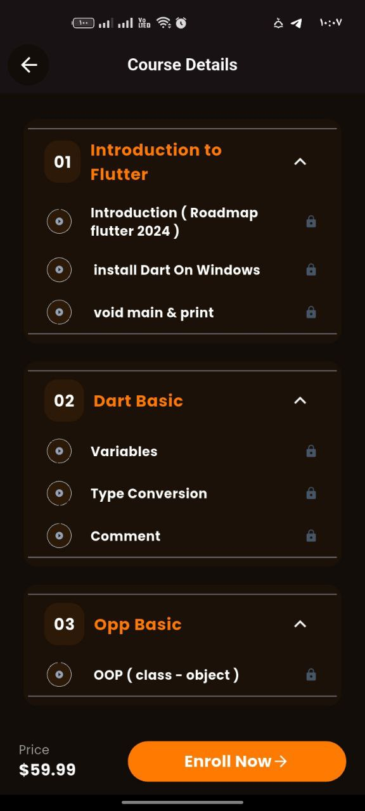

# 🚀 Coursiq – Modern E-Learning Platform

### Coursiq is a premium online learning mobile application built with Flutter.
It provides a modern, scalable, and clean architecture solution for displaying and managing online courses with a high-quality user experience.

## 🏗 Architecture

### This project is structured using Clean Architecture:

lib/
 ├── core/
 ├── features/
 │    ├── auth/
 │    ├── details/
 │    ├── home/
 │    ├── main/
 │    ├── intro/
 ├── coursiq_app.dart
 ├── main.dart

 ## 📱 Screens
 

